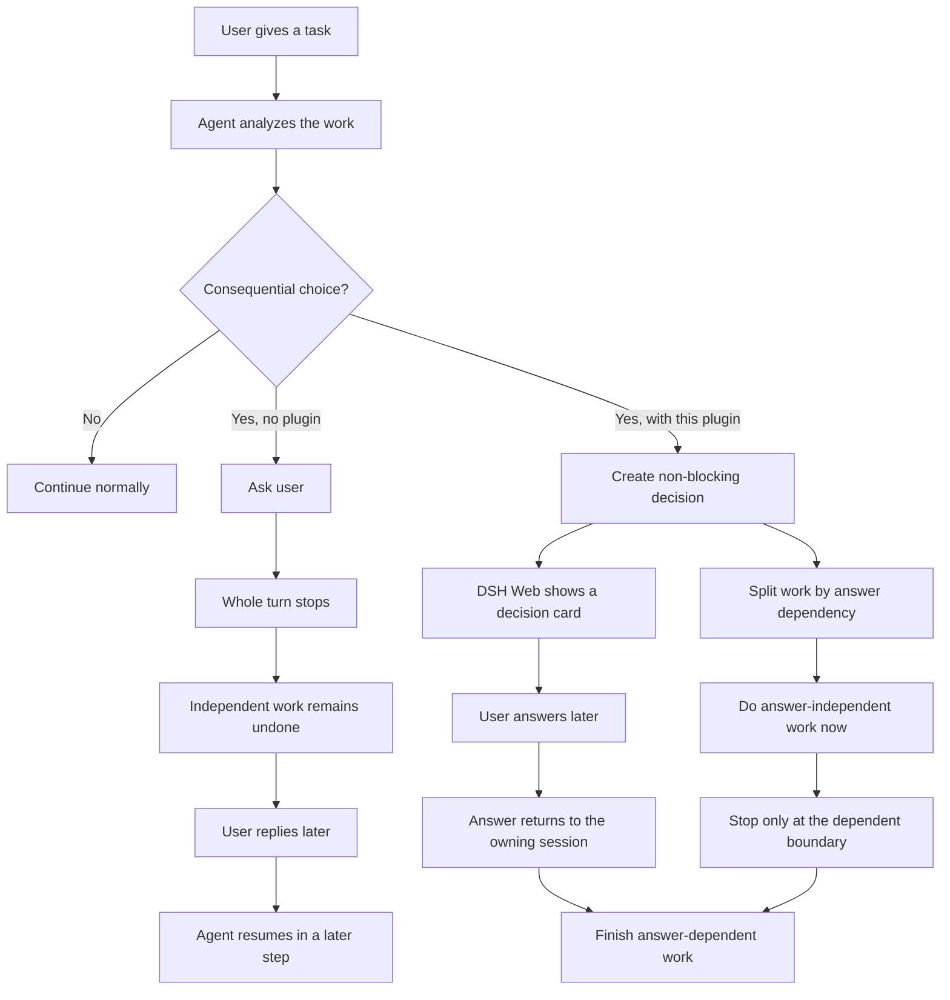

# dsh-decision-inbox

Let DeepSeek Harness agents ask important questions without stopping independent work.

`dsh-decision-inbox` is a non-blocking human decision inbox plugin for
[DeepSeek Harness](https://github.com/deepseek-ai/deepseek-harness). When the
agent reaches a consequential user-owned choice, DSH Web can show a small
decision card while the agent continues work that does not depend on the answer.

It complements DSH's blocking user-question and approval flows. It does **not**
replace security approvals, permission prompts, authentication, or confirmation
for destructive actions.

## The idea

| Without a non-blocking decision inbox | With `dsh-decision-inbox` |
| --- | --- |
| The agent asks a question, then the whole turn often goes idle while waiting for the user. | The agent leaves only the decision-dependent branch pending, then keeps working on unrelated or safe preparation tasks. |
|  |  |

Full comic storyboard: [`docs/comic`](docs/comic).

## Flow



## What it provides

- A DSH Web decision card with clickable options and free-text answers.
- `decision_request`: create a pending question without blocking the tool call.
- `decision_list` and `decision_cancel`: inspect or cancel pending decisions.
- `/decision` fallback commands for listing, answering, cancelling, exporting,
  and importing.
- Durable JSON state, append-only audit log, export/import support, and remote
  sync surfaces for long-term integrations.
- Guidance that lets the model decide when a choice is important enough to ask,
  while routine reversible details still use a reasonable default.

## Quick start

Clone and build the plugin:

```bash
git clone https://github.com/ThirtySeven-3737/dsh-plugin-decision-inbox.git
cd dsh-plugin-decision-inbox
pnpm install
pnpm build
```

Add it to a DeepSeek Harness profile:

```bash
cd /path/to/deepseek-harness
pnpm dsh plugin --profile web add file:/path/to/dsh-plugin-decision-inbox
pnpm dsh web
```

Then open DSH Web and start a new session:

```text
http://127.0.0.1:3080
```

Try a task with a consequential user-owned choice, for example:

```text
I want to add a remote sync capability for pending decisions in this plugin,
and other tools may integrate with it long term. Please decide the best
implementation approach and build it.
```

Expected behavior:

1. The agent identifies the consequential choice.
2. A **Pending decision** / **待你决定** card appears.
3. The agent continues answer-independent work while the card is open.
4. After the user answers, the answer is delivered back to the owning session
   and the agent finishes the dependent work.

## Development

```bash
pnpm check
pnpm test
pnpm build
```

The normal test suite does not require a model API key. Optional autonomy
evaluation can read `DEEPSEEK_API_KEY` or a local `env.txt`.

## More details

- Full technical reference: [`docs/technical-reference.md`](docs/technical-reference.md)
- Release notes: [`CHANGELOG.md`](CHANGELOG.md)
- Contributing guide: [`CONTRIBUTING.md`](CONTRIBUTING.md)
- Security policy: [`SECURITY.md`](SECURITY.md)
