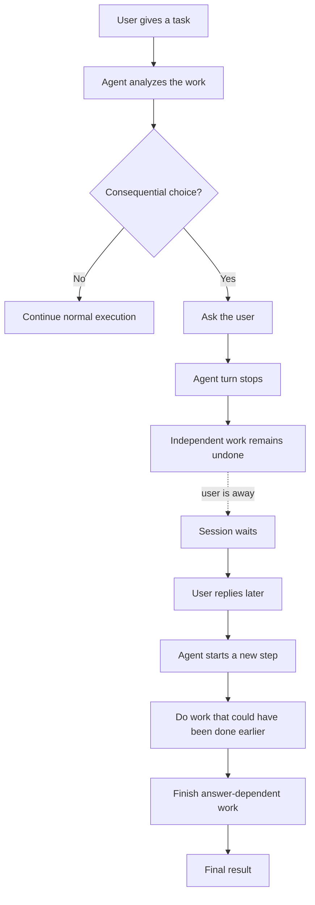
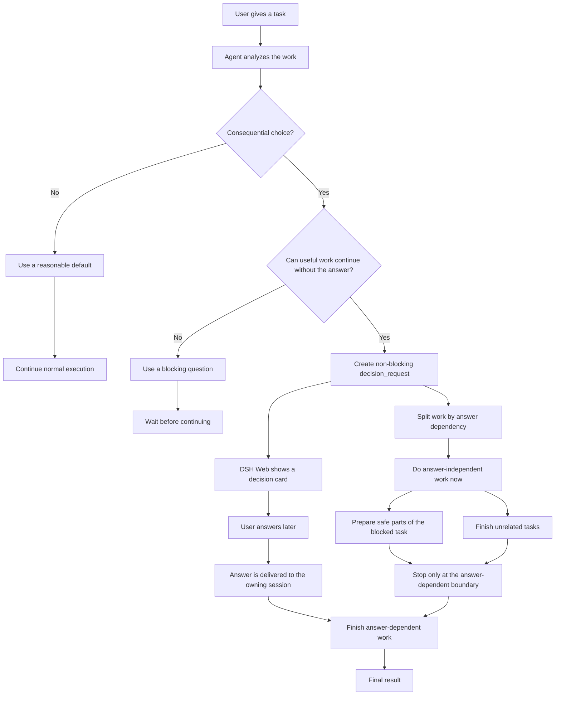

# dsh-decision-inbox

Non-blocking human decisions for [DeepSeek Harness](https://github.com/deepseek-ai/deepseek-harness).

An agent can ask a question, receive a stable `decision_id` immediately, and continue useful independent work. When the user answers later, the plugin steers that answer into the exact owning session at its next safe agent boundary.

This complements DSH's blocking `ask_user_question` tool. It does **not** replace permission prompts, security approval, authentication, or confirmation for destructive actions.

## Why this exists

Without a non-blocking decision inbox, a user-facing question usually becomes a
turn-level stop point. Even if other work does not depend on the answer, the
whole session often goes idle until the user replies.



With `dsh-decision-inbox`, only the answer-dependent branch waits. The agent
can keep working on unrelated tasks and safe preparation while the decision
card stays pending in DSH Web.



## Project status

Experimental but functional. The current package is tested against DeepSeek
Harness `0.1.0-rc.5` packages and Node.js 24+. DSH is still moving quickly, so
plugin APIs and integration points may need updates as upstream changes.

Before publishing a fork or release, review `RELEASE_CHECKLIST.md` and fill in
real GitHub `repository`, `homepage`, and `bugs` metadata in `package.json`.

## Current release

- Autonomous triggering guidance: the model decides when an unresolved user
  preference is consequential; the user never has to name this plugin or its
  tools. Routine, reversible details still use a reasonable model-selected
  default instead of interrupting the user.
- DSH Web decision card: pending questions appear automatically above the
  composer with one-click options and a free-text answer field.
- The Web card hides internal decision ids and does not execute or display a
  slash command when the user answers.
- Compact multi-question paging, automatic refresh/restart recovery, and a
  retry action for answers durably saved before a steering failure.
- `decision_request`: create a pending question without blocking the tool call.
- `decision_list`: inspect this session's decision lifecycle.
- `decision_cancel`: cancel a pending question that no longer matters.
- `/decision`: user-side command for listing, answering, cancelling,
  exporting, and importing.
- Per-session ownership checks.
- Plugin-owned atomic JSON persistence under `$DSH_HOME/storages`.
- Append-only audit log (`decision-inbox.audit.jsonl`) with versioned NDJSON
  events, actor attribution, and a stable export API for other tools.
- Audit log export to CSV (default), wrapped JSON, or lossless NDJSON, from
  the library (`dsh-decision-inbox/export`), the `/decision export` command,
  and a download button in the Web decision card.
- Bulk import of historical decision records (JSON document or NDJSON),
  insert-only and atomic, with per-record `imported` audit events, from the
  library (`dsh-decision-inbox/import`), the `/decision import` command, and
  `ctx.decisionInbox.importDecisions` for other host plugins.
- Remote sync for long-term integration by other tools: a versioned
  `decision-inbox-sync` snapshot of actionable decisions across sessions plus
  strict `decision-inbox-answer` / `decision-inbox-cancel` submission parsing
  and application (durable commit first, in-process steer when the owner is
  live, outbox retry otherwise), from the library (`dsh-decision-inbox/sync`),
  `ctx.decisionInbox.syncPending` / `remoteAnswer` / `remoteCancel`, and an
  HTTP surface on the shared host web server (`GET /decision-inbox/sync`,
  `POST /decision-inbox/sync/answer|cancel`) behind the DSH Host trust fence
  with an optional bearer token.
- Stable UUID decision IDs that do not reset or collide after restart.
- Durable answer outbox with restart-safe retry of an interrupted delivery.
- Idempotent answer delivery after the durable delivered marker is committed: duplicate submissions do not trigger a second agent step.
- Retry-safe delivery when steering throws synchronously.
- Optional lazy expiry from one second to 30 days.

State mutations are serialized and written to a same-directory temporary file,
`fsync`ed, and atomically renamed before they become visible in memory. The
default plugin patch stores the complete state at
`$DSH_HOME/storages/decision-inbox.json` and appends audit events to
`$DSH_HOME/storages/decision-inbox.audit.jsonl`.

Answers use a durable outbox: the answer is committed as `delivery=pending`
before `agent.steer`, then becomes `delivery=delivered` after steering returns.
If the process stops between those points, resubmitting the same answer after
restart retries delivery. The steering message carries the stable decision ID
as an idempotency key. As with any outbox without a transaction spanning the
agent inbox and the filesystem, a crash after steering but before the delivered
marker reaches disk can cause an at-least-once retry; the model is explicitly
told not to repeat already-applied side effects for that ID.

The JSON backend is intentionally a single-writer store. Run only one DSH
process against a given `DSH_HOME`; two processes writing the same
`decision-inbox.json` are not coordinated and can overwrite each other's
updates. The same constraint applies to the audit log, which appends without
cross-process locking. A future multi-process deployment should use a
transactional backend or an explicit cross-process lock plus reload-on-write
semantics.

## Audit log

When `stateFile` is configured (the default DSH patch), the plugin keeps an
append-only audit log next to the state file. One JSON event per line, each
stamped with `schema: "decision-audit-event"` and `version: 1`, so external
tools can read it long-term without coupling to this package's internals.

Event types:

| type        | payload beyond the common fields                                |
| ----------- | ---------------------------------------------------------------- |
| `created`   | `question`, `options`, optional `expiresAt`                      |
| `answered`  | `answer`                                                         |
| `cancelled` | optional `cancelReason`                                          |
| `expired`   | —                                                                |
| `delivered` | —                                                                |
| `imported`  | full record snapshot incl. `status` and `deliveryStatus` (bulk import) |
| `checkpoint`| `decisions` plus per-status counts (written once after startup)  |
| `aborted`   | `operation`, `reason`, `decisionIds` (a state save failed)       |

Common fields: `seq` (monotonic per file), `ts` (epoch ms), and `actor`
(`agent` — created or cancelled via a model tool; `user` — answered or
cancelled via the Web card or `/decision`; `system` — expiry, delivery
completion, checkpoints, and runtime-level defaults). Lifecycle events also
carry `decisionId`, `ownerId`, and `revision`.

Consistency: audit events are fsynced **before** the state snapshot is saved,
so an applied state change can never miss its audit record. If the state save
fails afterwards, an `aborted` event is appended and the mutation fails. A
crash between the two writes can therefore leave audit events without a
matching state change; treat the state file as authoritative for the current
state.

### Export API

The `dsh-decision-inbox/audit` module exposes a stable reader for external
tools:

```ts
import { auditPathFor, readAuditLog, iterateAuditLog } from 'dsh-decision-inbox/audit'

const path = auditPathFor('/path/to/DSH_HOME/storages/decision-inbox.json')

// Whole log with filters:
const { events, corruptLines } = await readAuditLog(path, {
  ownerId: 'session-1',
  types: ['answered'],
  sinceTs: Date.now() - 24 * 60 * 60 * 1000,
})

// Streaming export, resumable by sequence number:
for await (const event of iterateAuditLog(path, { afterSeq: lastExportedSeq })) {
  await sink.write(event)
}
```

Filters: `ownerId`, `types`, `sinceTs`/`untilTs` (inclusive), and `afterSeq`
(exclusive). Corrupt lines are skipped and either counted (`readAuditLog`) or
reported via the `onCorrupt` callback (`iterateAuditLog`); a missing file reads
as an empty log. Set `auditFile` in the plugin config to override the default
derived path; omit both `stateFile` and `auditFile` to disable audit logging.

### Export

The `dsh-decision-inbox/export` module streams the audit log into a
deliverable artifact for other tools, reusing the reader's filters and
corrupt-line tolerance:

```ts
import { exportAuditLog, exportPathFor, stringSink } from 'dsh-decision-inbox/export'

// CSV next to the audit log (default format), resumable by sequence:
const report = await exportAuditLog('/path/to/decision-inbox.audit.jsonl', {
  format: 'csv',
  destination: exportPathFor('/path/to/decision-inbox.audit.jsonl', 'csv'),
  filter: { afterSeq: lastExportedSeq },
})

// Or into memory, e.g. to hand the artifact to a web client:
const sink = stringSink()
await exportAuditLog('/path/to/decision-inbox.audit.jsonl', { format: 'ndjson', destination: sink })
const text = sink.text()
```

Formats:

| format   | shape                                                                                       |
| -------- | ------------------------------------------------------------------------------------------- |
| `csv`    | Flattened union table with a fixed 20-column header, RFC 4180 quoting, `\r\n` rows. Options are joined with ` \| `. |
| `json`   | One `decision-audit-export` document (`schema`, `version`, `exportedAt`, `events`, `corruptLines`). |
| `ndjson` | The lossless filtered event stream, one JSON event per line, identical to the source log.    |

A string destination is written atomically (temporary file, `fsync`, rename)
and must be absolute; any `AuditExportSink` is accepted instead. The result
reports `{ events, corruptLines, bytes, format, path? }`. Because the audit
log is a single-writer store that can grow while an export runs, an export
reflects the file as it is read and takes no lock.

The plugin exposes the same capability operationally:

- `/decision export [<path>] [--format csv|json|ndjson] [--owner <id>]`
  writes an export (default `decision-inbox.audit.csv` next to the audit log,
  or the given absolute path) and reports the event and skipped-line counts.
- The Web decision card's **导出审计日志** button downloads a CSV snapshot of
  the full log.
- `ctx.decisionInbox.exportAudit({ ... })` and `ctx.decisionInbox.auditPath`
  are available to other host plugins.

### Import

The `dsh-decision-inbox/import` module is the write-side counterpart of the
export surface: a stable, versioned text format other tools can produce
long-term, plus one-shot application into a live runtime:

```ts
import { DecisionRuntime } from 'dsh-decision-inbox'
import { importDecisionRecords, parseDecisionImport } from 'dsh-decision-inbox/import'

const runtime = new DecisionRuntime({ /* ... */ })

// Read + apply in one atomic step; the format is inferred from the extension.
const report = await importDecisionRecords(runtime, '/path/to/history.json', {
  onConflict: 'fail',
})
// { records, imported, unchanged, conflicts }

// Or parse and apply separately, e.g. for in-memory producers:
const records = parseDecisionImport(text, 'ndjson', 'my-archive')
await runtime.importRecords(records)
```

Formats:

| format   | shape                                                                                       |
| -------- | ------------------------------------------------------------------------------------------- |
| `json`   | One `decision-inbox-import` document (`schema`, `version`, `decisions`).                    |
| `ndjson` | One full decision record per line (blank lines allowed), friendly to streaming producers.    |

Records use exactly the persisted decision shape and invariants of the state
file: `id`, `ownerId`, `question`, `options`, `status`, `deliveryStatus`,
`createdAt`, `revision`, plus the optional lifecycle fields (`expiresAt`,
`answeredAt`, `answer`, `cancelledAt`, `cancelReason`, `deliveredAt`).
`.jsonl`/`.ndjson` paths read as NDJSON; anything else reads as the JSON
document. Parsing is strict — malformed JSON or a wrong wrapper document
fails the whole import with the offending line or index — and the merge is
atomic and insert-only: existing decision ids are never overwritten.
Identical records count as `unchanged`; a different record under an existing
id is skipped (`conflicts`) by default or fails the import with
`onConflict: 'fail'`. Imported records keep their original ids, timestamps,
and revision. A past-due pending record expires right after the import
commits, exactly like loaded state, and an answered record with
`deliveryStatus: 'pending'` joins the durable outbox and can be retried from
its owner's card — import is faithful, so the same artifact also works as a
hot restore of a state backup.

Each inserted record is written to the audit log as an `imported` event
carrying the full record snapshot; if the state save fails afterwards, an
`aborted` event is appended and the import fails without applying anything.

The plugin exposes the same capability operationally:

- `/decision import <path> [--format json|ndjson] [--on-conflict skip|fail]`
  merges the artifact (default format inferred from the extension) and
  reports the imported/unchanged/conflict counts.
- `ctx.decisionInbox.importDecisions({ source, format?, onConflict?, actor? })`
  is available to other host plugins.

### Remote sync

The `dsh-decision-inbox/sync` module is the transport-independent core of the
remote sync surface for long-term integration by other tools: a versioned
snapshot document external tools pull to see actionable decisions, plus
strict parsers and application helpers for remotely submitted answers and
cancellations.

Pull snapshot — `decision-inbox-sync` v1:

```json
{"schema":"decision-inbox-sync","version":1,"exportedAt":1730000000000,"decisions":[...]}
```

`decisions` uses exactly the persisted decision shape of the import format
(`id`, `ownerId`, `question`, `options`, `status`, `deliveryStatus`,
`createdAt`, `revision`, plus the optional lifecycle fields). The snapshot
carries every `pending` decision and every `answered` decision whose delivery
is still `pending`, across all sessions.

Submissions — `decision-inbox-answer` v1 and `decision-inbox-cancel` v1:

```json
{"schema":"decision-inbox-answer","version":1,"id":"decision-...","answer":"Use SQLite"}
{"schema":"decision-inbox-cancel","version":1,"id":"decision-...","reason":"No longer relevant"}
```

Parsing is strict, like the import format: a wrong schema/version or a
malformed field throws instead of silently misapplying a remote submission.
An answer commits durably first — exactly like a Web card answer — and then
steers the owning agent in-process when it is live (`delivered: true`); when
it is not, the answer stays in the durable outbox (`deliveryStatus:
'pending'`) for later retry and the result reports `delivered: false`.
Duplicate submissions with the same answer are not delivered twice.

```ts
import {
  applyRemoteAnswer,
  applyRemoteCancel,
  buildSyncSnapshot,
  parseRemoteAnswer,
  parseRemoteCancel,
} from 'dsh-decision-inbox/sync'

const snapshot = await buildSyncSnapshot(runtime)
// { schema: 'decision-inbox-sync', version: 1, exportedAt, decisions }

const { id, answer } = parseRemoteAnswer(payload)
const result = await applyRemoteAnswer(runtime, ownerId => agents.get(ownerId), id, answer)
// { kind: 'answered' | 'already-answered' | 'not-pending' | 'not-found', delivered }
```

The plugin exposes the same capability on the service:
`ctx.decisionInbox.syncPending()`, `ctx.decisionInbox.remoteAnswer(id,
answer)`, and `ctx.decisionInbox.remoteCancel(id, reason?)` are available to
other host plugins, with the owning agent resolved through `ctx.agents`.

#### Remote sync HTTP API

When the host composes `@deepseek-ai/dsh-host-webserver` (the DSH Web
profile), the plugin registers three exact routes on the shared web server,
so other tools can integrate over HTTP on the existing port:

| method | path                          | body / response                                                          |
| ------ | ----------------------------- | ------------------------------------------------------------------------ |
| `GET`  | `/decision-inbox/sync`        | 200: a `decision-inbox-sync` v1 snapshot                                 |
| `POST` | `/decision-inbox/sync/answer` | body: `decision-inbox-answer` v1; 200 result, 404 unknown, 409 not-pending |
| `POST` | `/decision-inbox/sync/cancel` | body: `decision-inbox-cancel` v1; 200 result, 404 unknown, 409 not-pending |

```powershell
# Pull every actionable decision across sessions:
Invoke-RestMethod http://127.0.0.1:3080/decision-inbox/sync

# Answer one by id (steers the owning agent when it is live):
Invoke-RestMethod http://127.0.0.1:3080/decision-inbox/sync/answer -Method Post `
  -ContentType 'application/json' `
  -Body '{"schema":"decision-inbox-answer","version":1,"id":"decision-...","answer":"Use SQLite"}'

# Cancel one by id:
Invoke-RestMethod http://127.0.0.1:3080/decision-inbox/sync/cancel -Method Post `
  -ContentType 'application/json' `
  -Body '{"schema":"decision-inbox-cancel","version":1,"id":"decision-..."}'
```

Success bodies carry the persisted decision record; errors carry
`{"error":{"code","message"}}` with status 400 (bad request), 401
(unauthorized), 403 (forbidden), 404 (unknown decision or route), 405 (wrong
method), 409 (decision not pending), and 413 (body too large; the cap is
64 KB).

Trust: the same Host-header fence DSH applies to its `/api` gateway —
loopback hosts always pass, and any bare canonical `host[:port]` authority
declared in `sync.trustedHosts` passes too; browser cross-site markers and
mismatched `Origin` headers are refused. This is a DNS-rebinding and
confused-deputy defense, not authentication: when the routes are widened
beyond loopback, set `sync.token` so every request must carry
`Authorization: Bearer <token>` (compared in constant time). Malformed
`trustedHosts` entries fail the plugin load loudly instead of silently
changing the grant.

Config example (extend the plugin entry in `cordis.patch.yml`):

```yaml
- insert:
    - id: decision-inbox
      name: dsh-decision-inbox
      config:
        stateFile: !!js dshHomePath('storages', 'decision-inbox.json')
        sync:
          # trustedHosts: [harness.internal]
          # token: replace-with-a-long-random-token
          # enabled: false
```

## Quick start: install from GitHub source

These steps assume you already have a working DeepSeek Harness checkout.

### 1. Add the plugin to a DSH profile

If the DSH CLI is available on your `PATH`:

```powershell
dsh plugin --profile web add github:ThirtySeven-3737/dsh-plugin-decision-inbox
```

If you run DSH from a source checkout:

```powershell
cd D:\deepseek-harness
pnpm dsh plugin --profile web add github:ThirtySeven-3737/dsh-plugin-decision-inbox
```

Because this repository is installed from GitHub source, pnpm may ask you to
approve the package build step. Allow the build for this plugin. The
`prepare` script builds the TypeScript sources into the `lib/` files that DSH
loads.

The included `cordis.patch.yml` inserts the host plugin as `decision-inbox`
and stores durable state under `$DSH_HOME/storages/decision-inbox.json`.

### 2. Restart DSH Web

If DSH Web is already running, stop it first with `Ctrl+C`, then start it
again:

```powershell
cd D:\deepseek-harness
pnpm dsh web
```

Open the local URL printed by `pnpm dsh web` and start a new session. In local
development this is often `http://127.0.0.1:3080`, but the exact port belongs
to your DSH Web setup, not to this plugin.

Use a new session after installation or upgrade, so the updated system prompt,
tools, and Web card are loaded.

### 3. Try it

No slash command or special prompt is required. Send a natural task that
contains a consequential user-owned choice but still has useful work the agent
can do before the answer. For example:

```text
I want to add a remote sync capability for pending decisions in this plugin,
and other tools may integrate with it long term. Please decide the best
implementation approach and build it.
```

Expected behavior:

1. The agent inspects the project and identifies the consequential integration
   choice.
2. A **Pending decision** / **待你决定** Web card appears.
3. The agent continues answer-independent work while the card is open.
4. After you click an option or provide a free-text answer, the answer is
   steered back into the owning session and the agent continues the dependent
   work.

### Local development install

When editing this plugin locally, clone and build the repository first:

```powershell
git clone https://github.com/ThirtySeven-3737/dsh-plugin-decision-inbox.git
cd dsh-plugin-decision-inbox
pnpm install
pnpm build
```

Then add the local working copy to DSH:

```powershell
cd D:\deepseek-harness
pnpm dsh plugin --profile web add file:E:/path/to/dsh-plugin-decision-inbox
```

For a full local verification run:

```powershell
pnpm check
pnpm test
```

The normal automated tests do not need a model API key. The optional
`pnpm eval:autonomy` command uses a real model API boundary and reads
`DEEPSEEK_API_KEY` or a local `env.txt`.

### Troubleshooting

- If no card appears, confirm the `web` profile includes
  `dsh-decision-inbox` and restart DSH Web.
- If you installed from a local directory and changed source code later, run
  `pnpm build` again, then reinstall or pack/re-add the plugin so the DSH
  profile sees the new build.
- Do not expect the plugin to ask about routine implementation details. It is
  intended for consequential choices such as public API shape, data format,
  architecture, scope, cost, migration policy, or external integration surface.

## Install from a packed tarball

For testing the exact package contents before publishing:

```powershell
cd E:\path\to\dsh-decision-inbox
pnpm pack

cd D:\deepseek-harness
pnpm dsh plugin --profile web add file:E:/path/to/dsh-decision-inbox/dsh-decision-inbox-0.5.0.tgz
pnpm dsh web
```

Restart DSH Web after replacing an installed tarball. If you reuse the same
version repeatedly during local testing, prefer a fresh tarball filename or
reinstall from the source directory to avoid package-manager cache confusion.

## Install after an npm release

This package is not assumed to be published yet. Once it is published to npm,
installation should become:

```powershell
cd D:\deepseek-harness
pnpm dsh plugin --profile web add dsh-decision-inbox
pnpm dsh web
```

Until then, use the GitHub source or packed tarball flow above.

## Local development notes

Useful commands while iterating on the plugin:

```powershell
pnpm install
pnpm check
pnpm test
pnpm build
pnpm verify
```

The `prepare` script also builds the package for direct `github:` installs.
As with every DSH git plugin, pnpm 10+ requires the user to allow that install-time
build explicitly. npm releases and prebuilt tarballs do not need that permission.

## Usage in DSH Web

No command or special prompt is required. The plugin tells the model to call
`decision_request` proactively when two or more reasonable paths would
materially change behavior, public interfaces, data shape, architecture,
scope, cost, or cause meaningful rework, and when other useful work can still
continue. A compact
**Pending decision** card opens above the composer. Click an offered option,
or choose **Other answer** and type free text. Multiple pending questions use
the previous/next controls in the same card.

The model should not open a decision for routine implementation details,
easily reversible choices, or matters already settled by repository
conventions. If the choice blocks every correct next step, DSH's normal
blocking user-question flow remains the right mechanism.

The card is session-scoped: it never displays or answers another session's
decisions. Closing or refreshing the page does not lose a pending question;
the card reloads actionable state from the durable Host store. The composer
remains usable and the agent continues independent work while the card is
open.

## Command fallback

Headless/TUI clients and diagnostics can still use:

```text
/decision
/decision list all
/decision answer <decision-id> Use SQLite for the prototype
/decision cancel <decision-id> No longer relevant
/decision export
/decision export /tmp/decisions.ndjson --format ndjson --owner <session-id>
/decision import /tmp/history.json
/decision import /tmp/history.jsonl --format ndjson --on-conflict fail
```

With no arguments, `/decision` lists pending questions. Answered list entries
also show `delivery=pending|delivered`. An accepted answer is delivered as
user-authored steering: if the agent is running, it is consumed at the next
step boundary; if idle, it starts a turn.

## Development

```powershell
pnpm check
pnpm test
pnpm build
pnpm eval:autonomy
```

The automated suite currently contains 165 tests covering Web RPC isolation,
one-click and free-text UI answers, compact multi-question paging, undelivered
answer retry, integration,
concurrent creates and answers, answer/cancel races, persistence rollback,
restart recovery, outbox retry, expiry boundaries, Unicode/multiline data,
defensive cloning, malformed-state validation, and audit log events, sequence
recovery, filtering, corrupt-line handling, aborted-state markers,
CSV/JSON/NDJSON export with quoting, filters, sinks, and atomic file writes,
JSON/NDJSON import parsing, conflict policies, atomic rollback, imported
audit events, file-level merge reports, remote sync snapshot building,
submission parsing and application (offline outbox, idempotent retry), the
sync HTTP routes including the Host trust fence, bearer token, status
mapping, and request-body caps, and end-to-end sync exchanges against a real
composed web server.
It uses
a fake agent, deterministic clock, in-memory restart fixtures, and temporary
atomic JSON files. No model API key is required.

`pnpm eval:autonomy` is an opt-in real-model eval for the autonomous trigger
policy. It reads the shared system-prompt guidance and tool schema from
`src/index.ts`, then runs them against the 16 natural-language cases in
`evals/autonomy-cases.json`. Those prompts do not mention this plugin, its tool
names, explicit options, or "do unrelated work while waiting" instructions;
they describe ordinary product and engineering goals where the model must infer
whether a consequential user choice exists. They cover consequential choices
that should call `decision_request`, a fully blocking choice that should use
the normal user-question tool, and routine or already-specified choices that
should not ask. Positive cases are two-step checks: after the simulated
`decision_request` result returns `pending`, the eval asks the model to
continue and verifies that the answer-independent work marker appears. The eval
reads `DEEPSEEK_API_KEY`, or a local `env.txt`, and is kept out of `pnpm test`
because model behavior is probabilistic and requires a network/API boundary.

## Manual end-to-end acceptance test

Use one request containing two tasks: task A must wait for a user-owned choice,
while task B is explicitly independent. Ask the agent not to wait or poll.

1. Confirm that `decision_request` returns a pending id and task B completes
   before the user answers.
2. Confirm that task A's output does not exist yet.
3. Click an option in the decision card in the same live session.
4. Confirm that the answer starts or steers the next step and task A completes.
5. Submit the identical answer again. The command must report that it was not
   delivered twice, and no additional model turn should start.

Example prompt:

```text
Complete two tasks. Task A: create COLOR_CHOICE.txt, but its content must be
chosen by me later from blue or green. Ask for that choice now without waiting,
and do not create the file before my answer. Task B is independent: immediately
create TEST_MARKER.txt containing exactly INDEPENDENT_TASK_DONE. Finish task B,
report the pending decision id, and do not poll for the answer.
```

## Planned next milestones

1. Push-based decision updates (SSE/WebSocket) on top of the pull sync routes.
2. Upstream DSH-level authentication to replace the plugin's bearer token.
3. Automated process-level crash tests in addition to the in-process restart suite.
4. Web card import (file upload/ paste) on top of the existing library and command surface.
